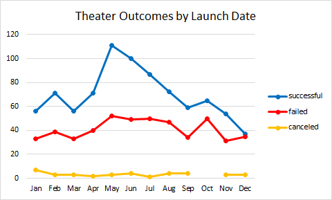
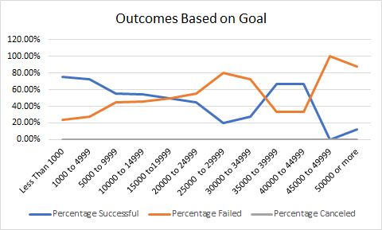

# An Analysis of Kickstarter Campaigns

## Overview of Project

This is a data analysis on several thousand crowdfunding projects. In this descriptive statistical analysis we used several MS Excel tools, pivot tables and graphing to visualize campaign outcomes.

### Purpose

The purpose of this project is to analyze thousand crowdfunding campaigns in a short amount of time to uncover any hidden trends. Our client is interested in how different campaigns performed in relation to their launch date and founding goals. In order to provide an analysis that is easy and clear to understand to our client. We used the Kickstarter dataset to visualize campaign outcomes based on their launch dates and their funding goals.

### Analysis of Outcomes

To start our analysis we first cleaned and filtered our dataset to have a better understanding of our data. Then we proceed to use pivot tables and charts to visualize our data. 

First we analyzed the dataset per parent category by creating a pivot table and charting the data.

Fig 1.1 Outcomes by parent category

By looking at the data in Fig 1.1, we can easily identify that theater and music parent categories performed very well. Now we will do a more deeper analysis by looking into subcategories. This will allow us to provide data in areas that are more relevant to our client.

Fig 1.2 Outcomes by subcategory

As we can see in the chart, plays subcategory performed very well, making the "theater" category the most successful.

### Analysis of Outcomes Based on Launch Date

Now we created a chart based on “Outcomes on Launch Date”. Based on our data analysis we can easily identify that the month with the most successful kickstarter campaigns were May and June. However, the month of June had a higher number of failed campaigns similar to January, July and October.  

Fig 1.3 Outcomes based on launch date

We have already determined that “theater” was a very successful category and by filtering our “Outcome based on Launch date” for theater. Using Fig 1.4, we can identify that the data for this subcategory follows the overall trend and making the data for this category more predictable.

Fig 1.4 Theater Outcomes vs Launch

### Analysis of Outcomes Based on Goals

Per our data analysis, we are able to visualize that campaigns that had a lower goal as a starting had a greater success rate. Then as campaigns started to increase their starting goal the rate of success and failure was about the same but for campaigns with very high starting goals the failure rate was higher as we can see in figure 1.5. Based on this analysis we can conclude that the success rate decreased with higher starting campaign goals. 

Fig 1.5 Outcomes vs Goals

### Analysis of Central Tendency

Our client is interested in Great Britain's theater market, especially musicals. So far in our analysis we have provided our client with some of this information, but to provide a bigger picture and more robust analysis. We used a box plot as a measurement of central tendency and data distribution. 

Fig 1.6 Boxplot, distribution of campaign goals vs pledges

Per our plot we can see that the mean campaign goal is around $4000, this value is outside of the range of outliers for amount pledged.

### Challenges and Difficulties Encountered

While  performing our data analysis, we encounter some challenges. when performing the 2nd deliverable analysis. The COUNTIFS function can be challenging to apply, especially  when we have datasets in different ranges with multiple criteria. 

Another area that can be challenging for this analysis is the central tendency analysis as you will need to have some knowledge or understanding in statistics. 

## Results

###Outcomes based on Launch Date

- Per our data analysis we can easily conclude that the month with the  most successful kickstarter campaigns was May.
- We were able to determine that “theater” was a very successful category. The data for this subcategory follows the overall trend and makes the data more predictable.

###Outcomes based on Goals

-Based on this analysis we can conclude that the success rate decreased with higher starting campaign goals. 

- What are some limitations of this dataset?

- For this analysis we could also consider pie chart, histograms. 

